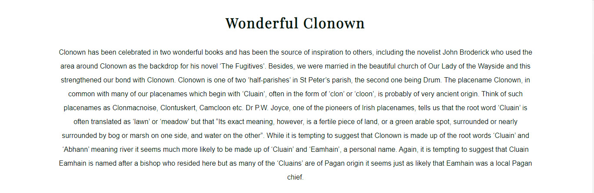

# # **# Clonown Community **

 
A website about the community area of Clonown an area on outskirts of Athlone Town, in the County of Roscommon, located in centre of Ireland. Our goals are to provide information and news about: 

- Amenities 

- Facilities 

- Social events 

- History  

- Local Businesses 

- Local Crafts 

- Community Alerts 

- Connecting the local community and visitors 

 

 

## **Features** 

**Navigation Menu**

Featured on all pages within website, as _self hyperlinks to the Home screen, Gallery, Sign Up and Contact pages for consistency and clear navigating throughout the Website. 

This menu allows users to move between pages seamlessly without the need for using the browser controls, e.g., back button, or without opening new tabs when a hyperlink is clicked. 

The Navigation menu contains a search field for easy assistance in searching the content on the website. (This functionality is still under development) 

For the title and navbar font I tried to do a transparent background but due to the photo being used I wasnt happy with the result, so I decided to go with a bright font and use a dark outline to give a better contracting effect against the image, below is how I achieved this result.

h1, h2 {

    font-family: 'Playfair Display', sans-serif;
    letter-spacing: 2px;
    text-transform: capitalize;
        
    /*make white color with black border for main header to make contrast with background*/

    color: whitesmoke;   
    text-shadow:
    -1px -1px 0 #0f0e0e,
    1px -1px 0 #0f0e0e,
    -1px 1px 0 #0f0e0e,
    1px 1px 0 #0f0e0e; 
    
}

When the mouse moves over the URLs, I wanted the font size to slighly increate to make the controls more obvious for users so I used a CSS pseudo-class as per below:

#nav-menu li:hover {
    
    transform: scale(1.2);  
    
}

**Landing Page**

Header - the website header contains the Navigation Menu as described above section. The header also contains the Website Name, Slogan and Background image which was taken on some farming land within the Clonown area.

History - Under the Navigation Menu and Header image is a section that contains some historic information about Clonown on how the area got its name. Being new to the area covered in my website, along with English not being my native language, it was a case of learning both the language and history of the area so I found it best to use a local media company as the source for my information.

Featured Images - Next is a section containing some featured images taken within the Clonown area, the images will enlarge when the mouse is moved over any of the images. To achieve this result I tried a few different ways the first was inline-block but I couldnt get it to achieve the look I was after so changed and used flexbox in order to display the images in equal size.

*Flexbox Information:*
> The Flexbox Layout (Flexible Box) module (a W3C Candidate Recommendation as of October 2017) aims at providing a more efficient way to lay out, align and distribute space among items in a container, even when their size is unknown and/or dynamic (thus the word “flex”). The main idea behind the flex layout is to give the container the ability to alter its items’ width/height (and order) to best fill the available space (mostly to accommodate to all kind of display devices and screen sizes). A flex container expands items to fill available free space or shrinks them to prevent overflow. Most importantly, the flexbox layout is direction-agnostic as opposed to the regular layouts (block which is vertically-based and inline which is horizontally-based). While those work well for pages, they lack flexibility (no pun intended) to support large or complex applications (especially when it comes to orientation changing, resizing, stretching, shrinking, etc.).

#row {

    display: inline-flex;
    overflow:visible;
    clear: both;
    line-height: 0;
    column-count: 4;
    column-gap: 0.5%;
    margin: 5%;
           
}

#row img {

    width: 100%;
    transition: 2s;
    display: block;
    
}

After getting the images aligned and spaced evenly with flexbox, I then want to add some responsive effects when the user moved the mouse over the images, i did this by using a CSS Pseudo-class as follows:

#row img:hover {

    transform: scale(1.2); 
    border: #90b77d solid 5px; 
        
}

After the featured images I decided to add a youtube video with the same width as the featured images block so that visitors can interact more with the website and see aerial footage of the community. The youtube video was added using the YouTube embed code provided on the YouTube video page but I added my own class to control the size and height of the video iframe.

`<iframe id="youtube" src="https://www.youtube.com/embed/MrRBxN9awLQ" title="YouTube video player" frameborder="0" allow="accelerometer; autoplay; clipboard-write; encrypted-media; gyroscope; picture-in-picture" allowfullscreen></iframe>`

Clonown Alerts & News – A section to display community alerts, news articles or events such as Christmas Markets, sporting events, School or Church announcements.

Inline flex was used again here for the Alerts and News section as it allowed me to in the future, easily change or add new items and retain the layout.

Footer - The footer contains links to related social media accounts on the following platforms: 

- Facebook 

- Twitter 

- Wikipedia 

- Instagram 

It also contains a _self hyperlink to the contact page so that users can quickly see how they can get in touch without needing to scroll back up to the menu on the top. 
The icons on this footer are there in order help the user interact more with the website but I didnt want users to leave my website when clicking these icons so I used the attribute
 `target='_blank'`

## Gallery 

The gallery will contain some images of historic buildings, nature, flooding and amenities. The images are intended to be memories for past and present residents and/or motivation, to encourage visitors to come to the area. In regards to the styling I used 4 columns in large screens and on smaller screens 600px or below it only has 2 columns. The images are styled to have a `column-gap` an and `line-height` because I didnt want the photos to look merged. 

#gallery-img {
    
    margin: 1rem 0;
    clear: both;
    column-count: 4;
    line-height: 3;    
    column-gap: 1rem;    

}

## Sign Up 

This page will allow the user to sign up to be included in our newsletters and alerts in order to stay up to date with community events and news such as possible illegal dumping, flooding from the nearby River Shannon etc. For the sign up form I used radio buttons and checkboxes to capture information from my applicant. 

## Contact 

A contact page that helps the user of the website to get in touch with the administrator, this maybe regarding get their event, business offerings or alert out to other community residents.
For the contact page I made the mobile number a hyperlink so that the user could with a single click enter our number into their mobile phone dialler. 

<!--Mobile phone with anchor element-->

`<h4><a href="tel:+380901111111"> <i class="fas fa-phone-volume"></i> (090)1111111</a></h4>`

On the contact page I also added an embeded map from Google Maps, where the height and width of the map is defined in the CSS stylesheet.

`#map {
        /*Place map in the middel of small screen*/
        width: 98%;
        height: 350px;
        margin: 5% 1%;
    }`

## Testing 

**CSS Style Testing**

I tested my website appearance and functionality across multiple devices and screen sizes, below are some examples of the testing performed and the results. 

- PC Monitor – Full HD 1920px x 1080px 

- Windows 10 Laptop 1366px x 768px 

- Android OnePlus 6.3” screen  

- Lenovo Tablet 10.1” screen 

**Performance Testing** 

I conducted tests on how quickly my website loaded using different connections such as mobile data and home fibre via Wi-Fi in most cases the website always loaded within 2-5 seconds from mobile data and under 2 seconds when using WIFI from my home fibre connection. 

**Browser Compatibility** 

The website was tested across the following browsers for any bugs: 

- Chrome 
- Firefox 
- Edge 

Testing document: 

https://1drv.ms/x/s!AvJgYZrLWaJmexwwAqsLAe21lZ0?e=Fl39f5 

**Validator Testing**

- HTML
No errors were returned when passing through the official W3C validator
- CSS
No errors were found when passing through the official W3C CSS validator. 
Warning about "Imported style sheets are not checked in direct input and file upload modes" 

**Unfixed Bugs**

Display issue on the Home screen while using Firefox from Windows PC (1080p) or Laptop (768p), when viewing the News & Alerts section the image size is not displayed correctly. 

## Credits

**Content**: 

The text for the Home page was taken from [Westmeath Independant ](https://www.westmeathindependent.ie/2022/03/28/street-wise-athlone-clonown/)

The icons in the footer were taken from [Font Awesome ](https://fontawesome.com/) 

[Stack Overflow](https://stackoverflow.com/) was used for help with CSS Styling. 

Fonts were taken from [Google Fonts](https://fonts.google.com/). 

CSS Flexbox tools - [Flexbox](https://css-tricks.com/snippets/css/a-guide-to-flexbox)

YouTube was used as a method to display a video on my website [YouTube](www.youtube.com)

**Media** 

Any images or videos used within this website were taken by the site developer and are considered the property of Clonown Community website. 

 