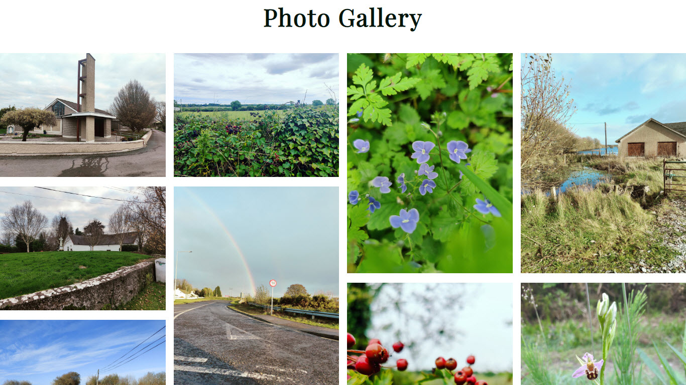

# # **# Clonown Community **

 
A website about the community area of Clonown an area on outskirts of Athlone Town, in the County of Roscommon, located in centre of Ireland. Our goals are to provide information and news about: 

- Amenities 

- Facilities 

- Social events 

- History  

- Local Businesses 

- Local Crafts 

- Community Alerts 

- Connecting the local community and visitors 

 

 

## **Features** 

**Navigation Menu**

Featured on all pages within website, as _self hyperlinks to the Home screen, Gallery, Sign Up and Contact pages for consistency and clear navigating throughout the Website. 

This menu allows users to move between pages seamlessly without the need for using the browser controls, e.g., back button, or without opening new tabs when a hyperlink is clicked. 

The Navigation menu contains a search field for easy assistance in searching the content on the website. (This functionality is still under development) 

**Landing Page**

Header - the website header contains the Navigation Menu as described above section. The header also contains the Website Name, Slogan and Background image which was taken on some farming land within the Clonown area. 

History - Under the Navigation Menu and Header image is a section that contains some historic information about Clonown on how the area got its name. 

Featured Images - Next is a section containing some featured images taken within the Clonown area, the images will enlarge when the mouse is moved over any of the images. 

Clonown Alerts & News – A section to display community alerts, news articles or events such as Christmas Markets, sporting events, School or Church announcements. 

Footer - The footer contains links to related social media accounts on the following platforms: 

- Facebook 

- Twitter 

- Wikipedia 

- Instagram 

It also contains a _self hyperlink to the contact page so that users can quickly see how they can get in touch without needing to scroll back up to the menu on the top. 

## Gallery 

The gallery will contain some images of historic buildings, nature, flooding and amenities. 

The images are intended to be memories for past and present residents and/or motivation, to encourage visitors to come to the area 

## Sign Up 

This page will allow the user to sign up to be included in our newsletters and alerts in order to stay up to date with community events and news such as possible illegal dumping, flooding from the nearby River Shannon etc. 

## Contact 

A contact page that helps the user of the website to get in touch with the administrator, this maybe regarding get their event, business offerings or alert out to other community residents. 

## Testing 

**CSS Style Testing**

I tested my website appearance and functionality across multiple devices and screen sizes, below are some examples of the testing performed and the results. 

- PC Monitor – Full HD 1920px x 1080px 

- Windows 10 Laptop 1366px x 768px 

- Android OnePlus 6.3” screen  

- Lenovo Tablet 10.1” screen 

**Performance Testing** 

I conducted tests on how quickly my website loaded using different connections such as mobile data and home fibre via Wi-Fi in most cases the website always loaded within 2-5 seconds from mobile data and under 2 seconds when using WIFI from my home fibre connection. 

**Browser Compatibility** 

The website was tested across the following browsers for any bugs: 

- Chrome 

 

 

Testing document: 

https://1drv.ms/x/s!AvJgYZrLWaJmexwwAqsLAe21lZ0?e=Fl39f5 

 

**Unfixed Bugs**

Display issue on the Home screen while using Firefox from Windows PC (1080p) or Laptop (768p), when viewing the News & Alerts section the image size is not displayed correctly. 
 

## Credits

**Content**: 

The text for the Home page was taken from [Westmeath Independant ](https://www.westmeathindependent.ie/2022/03/28/street-wise-athlone-clonown/)

The icons in the footer were taken from [Font Awesome ](https://fontawesome.com/) 

[Stack Overflow](https://stackoverflow.com/) was used for help with CSS Styling. 

Fonts were taken from [Google Fonts](https://fonts.google.com/). 

**Media** 

Any images used within this website were taken by the site developer and are considered the property of Clonown Community website. 

 